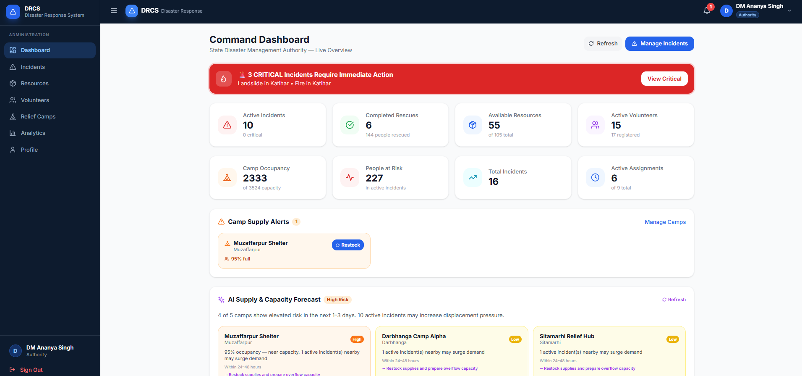
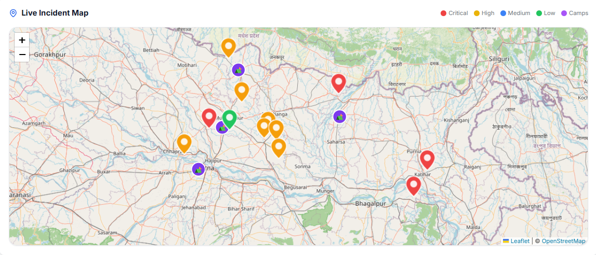

# DRCS — Disaster Response Coordination System

> A full-stack, AI-powered disaster management platform built for state emergency authorities, rescue volunteers, and affected citizens. Real-time incident tracking, AI volunteer matching, predictive supply forecasting, and live relief camp management — all running locally on JSON files with no database required.



---

## Features

### Three-Role Portal System

#### Citizen Portal
- Report disaster incidents with AI-powered priority scoring (Gemini)
- Track incident status and assigned rescue team in real-time
- View assigned volunteer's name and direct contact information
- Find nearest relief camps with live occupancy and supply stats
- Book beds at relief camps; cancel anytime with instant bed release
- Receive in-app notifications when help is dispatched

#### Volunteer Portal
- Browse and self-assign to open incidents in your district
- Accept or decline authority-assigned missions
- AI-generated **Mission Briefing** on every active assignment — equipment checklist, safety precautions, priority actions, estimated duration
- **Mark Mission Complete** to unlock the next assignment (enforced gate)
- Request resources (boats, medical kits, etc.) for active incidents
- View citizen contact details for direct field coordination

#### Authority Portal
- Full incident management with priority filters, map view, and PDF reports
- **AI Volunteer Matching** — Gemini ranks available volunteers by skill fit, district proximity, and blood group when opening the assign modal
- Assign volunteers and teams; volunteers get push notifications to accept/decline
- Manage relief camps: add/edit, adjust occupancy with +/− controls, one-click restock
- **AI Supply & Capacity Forecast** — predicts which camps will hit critical supply or capacity within 1–3 days
- Reactive supply alert panel with per-camp restock buttons
- Resource inventory management and resource request approval
- Volunteer approval, rejection, and deactivation
- AI situation summary (Gemini) and analytics dashboard

---

## AI Features (Gemini 1.5 Flash)

| Feature | Where | What it does |
|---|---|---|
| **Incident Priority Scoring** | Citizen report form | Scores 0–100, assigns Critical / High / Medium / Low with AI reasoning |
| **Volunteer–Incident Matching** | Authority assign modal | Ranks all available volunteers by skill, district, and blood group |
| **Mission Briefing** | Volunteer dashboard | Generates equipment list, safety precautions, and priority actions per assignment |
| **Supply & Capacity Forecast** | Authority dashboard | Predicts camp supply/capacity risk over the next 1–3 days |
| **Situation Summary** | Authority dashboard | AI narrative of the overall disaster situation |

All AI features have **rule-based fallbacks** — the app works fully without an API key.

---

## Tech Stack

**Backend**
- Python 3.11 + FastAPI
- Pydantic v2, python-jose (JWT), bcrypt
- Google Generative AI SDK (Gemini 1.5 Flash)
- ReportLab (PDF report generation)
- JSON file storage with `asyncio.Lock` — no database required

**Frontend**
- React 18 + Vite
- Tailwind CSS + Framer Motion
- React Router v6
- Leaflet (interactive incident + camp maps)
- date-fns, react-hot-toast, lucide-react

---

## Project Structure

```
DisasterRescue/
├── Backend/
│   ├── data/                       # JSON flat-file storage
│   │   ├── users.json
│   │   ├── incidents.json
│   │   ├── volunteers.json
│   │   ├── assignments.json
│   │   ├── relief_camps.json
│   │   ├── bookings.json
│   │   ├── resources.json
│   │   └── notifications.json
│   ├── routes/
│   │   ├── ai_routes.py            # Gemini AI endpoints
│   │   ├── assignments.py          # Rescue assignment + volunteer complete
│   │   ├── auth.py                 # JWT auth + user management
│   │   ├── incidents.py            # Incident CRUD + status updates
│   │   ├── relief_camps.py         # Camps, bed booking, restock
│   │   ├── resources.py            # Resource inventory
│   │   ├── volunteers.py           # Profiles, self-assign, approve
│   │   ├── analytics.py
│   │   ├── notifications.py
│   │   └── reports.py              # PDF generation
│   ├── services/
│   │   ├── ai_service.py           # Gemini prompts + rule-based fallbacks
│   │   ├── storage_service.py      # Async JSON read/write with locking
│   │   └── notification_service.py
│   ├── utils/
│   │   ├── auth.py                 # JWT helpers + get_current_user
│   │   └── helpers.py
│   ├── main.py
│   ├── requirements.txt
│   └── .env                        # API keys (not committed)
│
└── Frontend/
    ├── public/
    │   ├── dashboard_pic.png
    │   └── live_map.png
    ├── src/
    │   ├── pages/
    │   │   ├── Landing.jsx
    │   │   ├── Login.jsx / Register.jsx
    │   │   ├── authority/
    │   │   │   ├── AuthorityDashboard.jsx
    │   │   │   ├── IncidentManagement.jsx
    │   │   │   ├── VolunteerManagement.jsx
    │   │   │   ├── ReliefCamps.jsx
    │   │   │   ├── ResourceManagement.jsx
    │   │   │   └── Analytics.jsx
    │   │   ├── citizen/
    │   │   │   ├── CitizenDashboard.jsx
    │   │   │   ├── ReportIncident.jsx
    │   │   │   ├── TrackIncident.jsx
    │   │   │   ├── CampFinder.jsx
    │   │   │   └── Profile.jsx
    │   │   └── volunteer/
    │   │       ├── VolunteerDashboard.jsx
    │   │       └── OpenIncidents.jsx
    │   ├── components/
    │   │   ├── layout/             # DashboardLayout, Sidebar, Navbar
    │   │   ├── common/             # Modal, Badge, StatCard, LoadingSpinner
    │   │   └── map/                # IncidentMap (Leaflet)
    │   └── context/
    │       └── AuthContext.jsx     # JWT auth state + axios instance
    ├── package.json
    └── vite.config.js
```

---

## Setup & Installation

### Prerequisites
- Python 3.11+
- Node.js 18+
- Google Gemini API key (free tier) — [Get one here](https://aistudio.google.com/app/apikey)

### 1. Clone the repository

```bash
git clone https://github.com/Shivi-013/DRCS-Disaster-Response-Coordination-System.git
cd DRCS-Disaster-Response-Coordination-System
```

### 2. Backend setup

```bash
cd Backend
pip install -r requirements.txt
```

Create a `.env` file inside `Backend/`:

```env
GOOGLE_API_KEY=your_gemini_api_key_here
SECRET_KEY=drcs-super-secret-key-2024-disaster-response-coordination-system
ALGORITHM=HS256
ACCESS_TOKEN_EXPIRE_MINUTES=1440
```

Start the backend server:

```bash
uvicorn main:app --reload --port 8000
```

### 3. Frontend setup

```bash
cd ../Frontend
npm install
npm run dev
```

The app is now live at **http://localhost:5173**

---

## Demo Credentials

| Role | Email | Password |
|---|---|---|
| **Authority** | authority@drcs.gov.in | password123 |
| **Volunteer** | volunteer@drcs.gov.in | password123 |
| **Citizen** | citizen@drcs.gov.in | password123 |

---

## API Reference

The backend runs at `http://localhost:8000`. All routes are prefixed with `/api`.

| Prefix | Description |
|---|---|
| `/api/auth` | Register, login, JWT, user profile |
| `/api/incidents` | Incident CRUD, status updates, AI priority |
| `/api/volunteers` | Volunteer management, self-assign, approve |
| `/api/assignments` | Create/update assignments, accept/decline, complete |
| `/api/relief-camps` | Camp CRUD, bed booking, restock, occupancy |
| `/api/resources` | Resource inventory and allocation |
| `/api/ai` | Volunteer match, mission briefing, supply forecast, situation summary |
| `/api/reports` | PDF report generation per incident |
| `/api/analytics` | Dashboard statistics |
| `/api/notifications` | In-app notification feed |

Interactive Swagger docs: **http://localhost:8000/docs**

---

## Key Workflows

### Incident → Resolution

```
Citizen reports incident (free-form + form fields)
        ↓
Gemini scores priority  →  Critical / High / Medium / Low + reasoning
        ↓
Authority reviews  →  AI ranks volunteers by fit  →  Assigns team
        ↓
Volunteer notified  →  Accepts or Declines
        ↓
Volunteer gets AI Mission Briefing (equipment, safety, priority actions)
        ↓
Volunteer completes mission  →  Marks Complete  →  Freed for next mission
        ↓
Citizen notified  →  Incident status: Completed
```

### Relief Camp Loop

```
Citizens/Volunteers browse camps  →  Book N beds  (live count update across all portals)
        ↓
Authority monitors occupancy + reactive supply alerts
        ↓
AI Forecast predicts capacity/supply risk 1–3 days ahead
        ↓
Authority clicks Restock  →  food=30 days · water=10,000L · staff≥5
        ↓
All portals reflect changes via 20s auto-refresh
```

---

## Screenshots

### Live Incident Map


---

## Environment Variables

| Variable | Required | Description |
|---|---|---|
| `GOOGLE_API_KEY` | Optional | Gemini API key — app uses rule-based fallbacks without it |
| `SECRET_KEY` | Yes | JWT signing secret |
| `ALGORITHM` | Yes | JWT algorithm (HS256) |
| `ACCESS_TOKEN_EXPIRE_MINUTES` | Yes | Token lifetime in minutes |

---

## Notes

- No database — all data persists in `Backend/data/*.json` files with async file locking
- No cloud services — runs 100% on localhost
- The `.env` file is not committed; copy the values above and add your Gemini key
- PDF reports are generated server-side using ReportLab with incident data

---

## Built With

[FastAPI](https://fastapi.tiangolo.com/) · [React](https://react.dev/) · [Tailwind CSS](https://tailwindcss.com/) · [Google Gemini AI](https://ai.google.dev/) · [Leaflet](https://leafletjs.com/) · [ReportLab](https://www.reportlab.com/) · [Framer Motion](https://www.framer.com/motion/)
